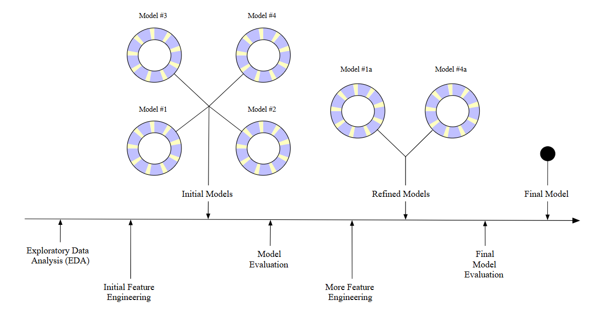

This r markdown outlines the basic steps necessary to use `tidymodels` packages to create models. Hopefully I will be able to easily follow this workflow as I am preparing the training/testing data and covariates for my thesis project.

These notes follow and take sentences and phrases from:
Kuhn, M., & Silge, J. (2021). Tidy Modeling with R. O'Reilly Media.
________________________________________________________________________________

**Chapter 5. Spending our Data**

***5.1 Common Methods for Splitting Data***

1. `set.seed()` and `initial_split()` the data
- Split the data at the independent experimental unit level of the data
- `initial_split()` will return an rsplit object that is strictly partitioning information

2. Use `training()` and `testing()` functions to actually divide the data

3. To avoid disproportional partitioning of samples, use the argument `strata = column_name` within `initial_split()`
- This argument will bin the data into quartiles and each quartile will be sampled separately and pooled together, this is called stratified sampling.
- You should really use stratified sampling, there are few downsides to it

4. If you want to validate the training dataset, you would use `initial_validation_split()` to get the rsplit partitioning object and `validation()` to actually partition the data.

***5.5 Chapter Summary***

```{r eval = FALSE}
# Here are the code snippets used in the book so far:
library(tidymodels)
data(ames)
ames <- ames %>% mutate(Sale_Price = log10(Sale_Price))

set.seed(502)
ames_split <- initial_split(ames, prop = 0.80, strata = Sale_Price)
ames_train <- training(ames_split)
ames_test  <- testing(ames_split)
```

**Chapter 6. Fitting Models with** `parsnip`

***6.1 Create a Model***

Linear regression models specify that the outcome data is numeric and that the predictors are related to the outcome in terms of simple slopes and intercepts. You can use ordinary linear regression or regularized linear regression to estimate the model parameters.

*Linear Regression* uses least squares to solve for model parameters
*Regularized Linear Regression* adds a penalty to the least squares method to encourage simplicity by removing predictors and/or shrinking their coefficients towards zero which is possible via Bayesian or non-Bayesian techniques

The tidymodels approach to specifying a model is:

a. Specifying the type of model based on mathematical structure (e.g., linear regression (`linear_reg()`), random forest, KNN, etc.)

b. Specify the engine for fitting the model (what software package should be used like `glmnet`) using `set_engine()`

c. Declare the mode of the model. This reflects the type of prediction outcome. For numeric outcomes, use regression and qualitative outcomes, use classification. Sometimes mode is set by default based on a certain model algorithm.

- You can use `translate()` to get a look at what's going on under the `parsnip` hood

***6.2 Use the Model Results***

- Use `extract_fit_engine()` to display the `parsnip` model object quantities (like the fitted model) and then apply normal methods like `vcov()` to object to plot or print.
- The `broom` package can modify results of a fit model using the `tidy()` function which converts the object into a tibble

***6.3 Make Predictions***

- The `predict()` function yields a tibble with the same number of rows as the input data and predictable column names (for example, `.pred`)
- Then, predictions can be merged with the original data seamlessly using `bind_cols()`.
- Use `type = "pred_int"` argument within `predict()` argument to include 95% confidence intervals to the tibble.

***6.6 Chapter Summary***

```{r eval = FALSE}
# Here are the code snippets used in the book so far:
library(tidymodels)
data(ames)
ames <- mutate(ames, Sale_Price = log10(Sale_Price))

set.seed(502)
ames_split <- initial_split(ames, prop = 0.80, strata = Sale_Price)
ames_train <- training(ames_split)
ames_test  <-  testing(ames_split)

lm_model <- linear_reg() %>% set_engine("lm")
```

**Chapter 7. A Model Workflow**

The `tidymodels` packages creates an object from `workflow()` that lists pieces of the modeling process like those in the modeling workflow below, this object is a single point of entry to the estimation components of a data analysis and organizes projects in an efficient manner.

```{r echo = FALSE, fig.show = "hold", fig.align = "default", out.width="900px", out.height="450px"}

```

***7.1 Where does the Model Begin and End?***

- "The model" refers to a structural equation relating predictors to an outcome.
- The outcome data are denoted *y~i~* where there are *i* = 1...*n* samples in the training set.
- There are *p* predictors *x~i1~*,...,*x~ip~* that are used in the model. Predictors can be nonlinear, for example, log(*x~i~*)).

Many choices and additional steps often occur before a model is fit. 

- Sometimes, you start with many candidate predictors and must use exploratory data analysis or domain knowledge to determine which predictors can be excluded from the analysis. A feature selection algorithm can also be used to decide upon the minimum predictor set of the model.
- Some values for certain predictors might be missing and could be imputed using other values if they are correlated with each other.
- The scale of a predictor might need to be changed, but if information about what the scale should be is unavailable, statistical transformation techniques, existing data, and optimization criterion can be used to estimate the proper scale

The above examples are related to steps that occur before the model fit, but there are operations that occur after the model is created. One of these additional steps is quantifying model performance (for example, PCA). 

***7.2 Workflow Basics***

Within the `workflows` package, you can bind modeling and preprocessing objects together.

```{r eval = FALSE}
# First, establish the linear model
lm_model <- linear_reg() %>%
  set_engine("lm")

# Second, start creating the workflow
# So far, this workflow has no preprocessor, just a model established
lm_wflow <- workflow() %>%
  add_model(lm_model)

# Third, use a standard R formula as a preprocessor 
# Now, the workflow has a preprocessor (formula) and a model established
lm_wflow <- lm_wflow %>%
  add_formula(Sale_Price ~ Longitude + Latitude)

# Fourth, use the fit() function in workflows to create the model using the parsnip object we created
# Now, the workflow has a preprocessor and a model (with coefficients) established
lm_fit <- fit(lm_wflow, ames_train)

# Fifth, call predict on the workflow
predict(lm_fit, ames_test %>% slice(1:3))

# The model and preprocessor can also be removed or updated
lm_fit %>% update_formula(Sale_Price ~ Longitude)
```

***7.3 Adding Raw Variables to the*** `workflow()`

The function `add_variables()` uses the arguments `outcome` and `predictors` to select single and/or multiple variables. This is simply a different way to pass data to the model within `workflows`.

```{r eval = FALSE}
# lm_wflow now has a preprocessor (variables) along with a model established
lm_wflow <- lm_wflow %>%
  remove_formula() %>%
  add_variables(outcome = Sale_Price, predictors = c(Longitude, Latitude))

# a general selector could also be used for the predictor variables
predictors = c(ends_with("tude"))

# also, outcome columns accidentally specified in the predictors argument will be removed so in theory, you could use:
predictors = everything()
```

Now, `fit(lm_wflow, ames_train)` can be run and all the specifications are assembled into a dataframe and passed to the underlying function.

***7.4 How Does a*** `workflow()` ***Use the Formula?***

The formula method in `R` has many purposes including properly encoding the original data into an analysis-ready format. This includes executing in-line transformations, creating dummy variables columns, creating interactions or other column expansions, etc. Other statistical methods require different types of encodings which make things confusing. For example, tree-based model packages don't encode categorical predictors as dummy variables and some packages have special inline functions. `workflows` emulates what the underlying model would do because preprocessing is model dependent using `add_formula()`.

*Tree-Based Models*

- If the `ranger` or `randomForest` packages are used, `worklow` knows predictors columns that are factors should be left as is.
- If the `xgboost` package is used, it requires the creation of dummy variables from factor predictors. This requirement is embedded in the model specification object and a `workflow` using `xgboost` will create the indicator columns for this engine.
- `C5.0` doesn't require dummy variables so a `workflow` using that engine will not create them.

*7.4.1 Special Formulas and Inline Functions*

Many multilevel models have standardized using the formula specification devised in the `lme4` package (`lmer(distance ~ Sex + (age | Subject), data = Orthodont)` to fit a regression model that has random effects for subjects, yielding an estimated intercept and slope parameter for `age`). However, basic `R` methods can't properly process a formula like that. The special formula has to be processed using the package code not the `model.matrix()` approach. The formula also specifies statistical attributes of the model, so the `model.matrix()` approach isn't the best anyways.

```{r}

```


